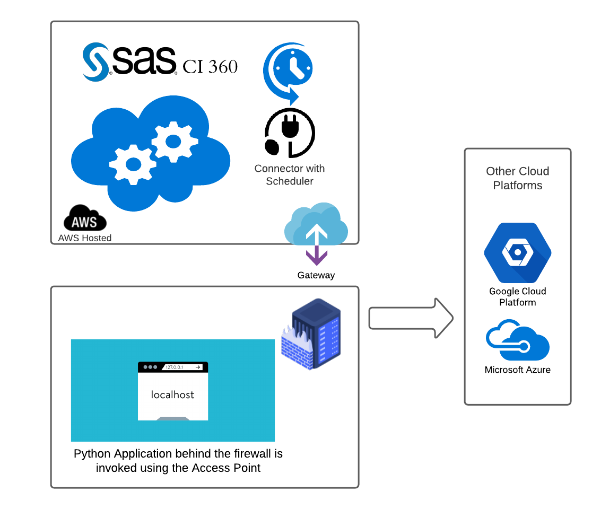

# CI360 Connector: Transfer data from CI360 UDM to Google Cloud Platform
This project illustrates an example of a SAS Customer Intelligence 360 (CI360) Connector that you can use to transfer data from the CI360 Unified Data Model (UDM) to other cloud providers, such as Google Cloud Platform. In this example, a connector is run on a local machine that is accessed from CI360 by using the agent infrastructure. The connector that runs on the local machine then talks to the CI360 UDM and Google Cloud to transfer data.


## Table of Contents

* <a href="#overview">Overview</a>
* <a href="#prereq">Prerequisites</a>
* <a href="#install">Installation</a>

<a id="overview"> </a>
## Overview
Using this project you can set up a new connector in CI360 that enables you to transfer your CI360 UDM data to other cloud providers, such as Google Cloud. 

This Project contains following artifacts.
* A Python code that runs on your local system, which acts as an on-premises connector. [app.py](app.py)
* A JSON connector configuration that you can import into CI360. [connector_definition.json](connector_definition.json)
* Configurations and illustrations to set up and run the connector by using the agent infrastructure.

<a id="prereq"> </a>
### Prerequisites

1. Install Python (version 3 or later) from https://www.python.org/.

   **Tip:** Select the option to add Python to your PATH variable. If you choose the advanced installation option, make sure to install the pip utility.
   
2. Make sure the following modules are installed for Python: `requests`, `gzip`, `codecs`, `base64`, `jwt`, `os`, `flask `, `google.cloud`, 
and `datetime`.

     In most cases, many of the modules are installed by default. To list all packages that are installed with Python 
     (through pip or by default), use this command:  
     ```python -c help('modules')```
     
     **Tip:** In most situations, you can install the non-default packages with this command:  
     ```pip install <package name>```
  

3. Create an access point in SAS Customer Intelligence 360.
    * From the user interface, navigate to **General Settings** > **External** > **Access**.
    * Create a new access point if one does not exist.
    * Get the following information from the access point:  
       ```
        External gateway address: e.g. https://extapigwservice-<server>/marketingGateway  
        Name: ci360_agent  
        Tenant ID: abc123-ci360-tenant-id-xyz  
        Client secret: ABC123ci360clientSecretXYZ  
       ```
4. Setup a Google Cloud Account.
    * Sign in to your Google Cloud Account
    * Open the Storage Section from the left pane or use the following link https://console.cloud.google.com/storage/browser/
    * Create a new Bucket to upload your data.
    * Open the Bucket and configure the permissions from the Permissions tab. It is recommended that you use a service account to manage the permissions for a storage bucket that can be modified by other services. For more information, see the documentation about Google Storage at https://cloud.google.com/storage/docs/projects#service-accounts
    * Create and download a Service Account JSON Key from your Google Cloud account by completing the steps given here https://cloud.google.com/iam/docs/creating-managing-service-account-keys.


5. Create a new connector and endpoint in SAS Customer Intelligence 360.
    * From the user interface, navigate to **General Settings** > **External** > **Connector**.
    * From overflow menu select Import JSON. Imoprt the following JSON file `connector_definition.json`.
    * The connector is preconfigured to automatically invoke at 1AM. Check and reset the connector schedule (if required)  to meet your needs.
    * Configure the connector to use the access point that you created in step 3.

<a id="install"> </a>
### Installation

- [ ]  Download the Python script `app.py` and save it to your local machine.
- [ ]  Set up Python3 with the required libraries.
- [ ]  Download and set the values of the following variables in [/config/config.txt](/config/config.txt):

       
        tenant_secret = Enter a valid tenant secret
        tenant_id     = Enter a valid tenant ID
        gateway_url   = Enter a valid gatway URL
        bucket_name   = A bucket must already exist in your Google Cloud Storage account
        credentials_file_path = Specify the local path of your Google Cloud Secret file
       
- [ ]  Open command prompt and change the directory to the location where you have saved the Python script. Run the application by using `flask run` command.
- [ ] Open a browser and access the following URL `http://127.0.0.1:5000/?tableName=<REPLACE_VALID_TABLE_NAME>` - Insert a valid table name in the URL.
- [ ] Start the Agent and test your connection from CI360.
- [ ] Each time that your scheduled connector invocation is triggered, you can see the logs in your agent console, and the file is uploaded to the Google Cloud Storage bucket that you configured 


## Contributing
We welcome your contributions! Please read [CONTRIBUTING.md](CONTRIBUTING.md) for details on how to submit contributions to this project. 

## License
This project is licensed under the [Apache 2.0 License](LICENSE).

## Additional Resources

* Please see CI360 Documentation:
    1. [External Data Integration with Connectors](https://go.documentation.sas.com/?cdcId=cintcdc&cdcVersion=production.a&docsetId=cintag&docsetTarget=ext-connectors-manage.htm&locale=en#p0uwf5nm4rrkn1n1gwrm03rh911r)
    2. [Create Access Points](https://go.documentation.sas.com/?cdcId=cintcdc&cdcVersion=production.a&docsetId=cintag&docsetTarget=ext-access-manage.htm&locale=en) 
* [Python Flask Documentation](https://flask.palletsprojects.com/en/1.1.x/)
* [Google Storage Service Documentation](https://cloud.google.com/storage/docs)
